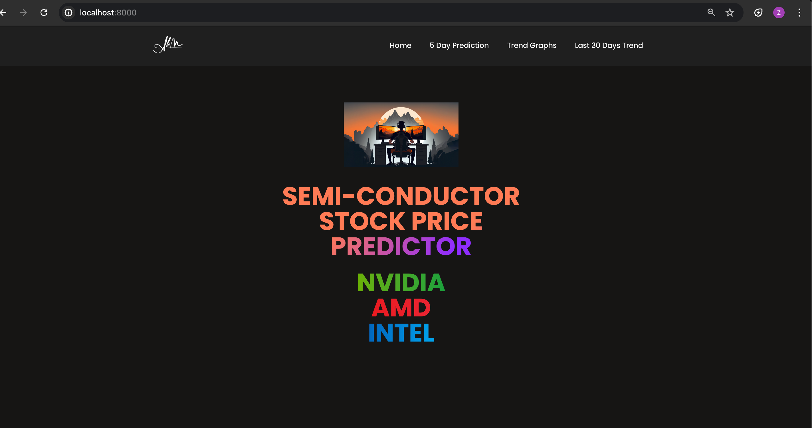

# Realtime-Stock-Prediction-Webapp

Academic project where the stock price prediction webapp uses LSTM Model trained on historical time series data and makes realtime predictions.

The WebApp is made on Django Framework in Python.

## Explorations

1. Django Framework
2. YFinance API
3. Time-Series Data
4. LSTM Model
5. D3.js Library

## Data

The data is downloaded from YFinance Api which comprises of historical 5 years stock data of NVIDIA, INTEL and AMD.

## LSTM

1. The LSTM Model is trained the downloaded data where each data point comprises of past 100 days of time-series data.

2. After that for each prediction, new data(for the past 100 days) is downloaded from YFinance API.

3. Predictions are used in plotting the trend graphs for the next 30 days, as well as showing crisp values for the next 5 days of predicted stocks.

## WebApp Images

### HomePage

### 5 Day Prediction

### Current Values of stocks

### Trend Graphs for next 30 days

### Trend Comparison of past 30 days

